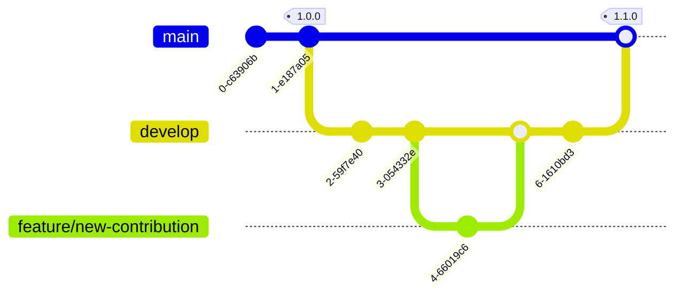

**Thank you for making Rekono greater!**


## Branches

**Create Pull Requests to the `develop` branch of this project**. All the Pull Requests should be reviewed and approved before been merged and after that, your code will be included in the next release.




## Development environment

Check documentation to prepare your Rekono contributions:

- [Architecture](https://github.com/pablosnt/rekono/wiki/Architecture)
- [From source installation](https://github.com/pablosnt/rekono/wiki/Installation#from-source)
- [Configuration](https://github.com/pablosnt/rekono/wiki/Configuration)


### Unit Tests

Unit tests can be executed using this command:

```
# pwd: rekono/
coverage run manage.py test
```

New Rekono contributions should tested using unit tests.


### CI/CD

This project has the following checks in _Continuous Integration_:

1. `Code style`: check the source code style using `mypy`, `flake8` and `eslint`.

2. `Desktop applications`: generate installers for Rekono Desktop in Linux, MacOS and Windows.

3. `SAST`: scan source code using `semgrep` to find vulnerabilities. This is a Static Application Security Testing.

4. `Secrets scanning`: check the source code using `detect-secrets` to find leaked passwords, tokens or other credentials that could be exposed.

5. `Unit testing`: check if the project works executing the unit tests.

6. `Snyk`: check the project dependencies to find libraries with known vulnerabilities. This is a Software Composition Analysis (SCA).

**All CI/CD checks should be passed before merging any Pull Request**, so it's advised to install the pre-commit hooks in your local repositories to check your changes before commit them:

```
# pwd: root directory
python3 -m pip install pre-commit
pre-commit install
```

### Way of Code

There are some guidelines to keep the code clean and ensure the correct working of the application:

- Keep code style
- Comment your code, specially classes and methods.
- Make unit tests for all your code to ensure its correct working.
- Don't include code vulnerabilities or vulnerable libraries.


## New hacking tool

The support of external hacking tools in Rekono is based on the following steps:

1. Define the hacking tools in the [tools/fixture](https://github.com/pablosnt/rekono/tree/main/rekono/tools/fixtures) files. There are one file for each required entity:
    
    - [`1_tools.json`](https://github.com/pablosnt/rekono/blob/main/rekono/tools/fixtures/1_tools.json): basic definition of the tool including information like name, command or reference link.
    
    - [`2_intensities.json`](https://github.com/pablosnt/rekono/blob/main/rekono/tools/fixtures/2_intensities.json): intensity levels supported by the hacking tools and the related argument needed to configure the executions.
    
    - [`3_configurations.json`](https://github.com/pablosnt/rekono/blob/main/rekono/tools/fixtures/3_configurations.json): tool configurations available in Rekono based on an argument pattern and identified by a name.

    - [`4_arguments.json`](https://github.com/pablosnt/rekono/blob/main/rekono/tools/fixtures/4_arguments.json): tool arguments whose value should be obtained from an input (previous findings, wordlists or target information).

    - [`5_inputs.json`](https://github.com/pablosnt/rekono/blob/main/rekono/tools/fixtures/5_inputs.json): different input types that could be valid for a tool argument sorted by priority.

    - [`6_outputs.json`](https://github.com/pablosnt/rekono/blob/main/rekono/tools/fixtures/6_outputs.json): different input types that a tool configuration can detect in the target.

2. Implement the parser to obtain findings from the tool results. You have to do that in the [tools/tools](https://github.com/pablosnt/rekono/tree/main/rekono/tools/tools) package:

    - Create a new Python file with the tool name in lower case and replacing whitespaces by `_`.
    
    - Create a new Python class with the tool name capitalized. This class needs to extend the `tools.tools.base_tool.BaseTool` class.

    - Override the method `parse_output_file` or `parse_plain_output` depending on the tool output type.

3. Add tool to default processes like `All tools` in the file [`1_processes.json`](https://github.com/pablosnt/rekono/blob/main/rekono/processes/fixtures/1_processes.json).

4. Implement [unit tests](https://github.com/pablosnt/rekono/tree/main/rekono/testing/tools) to check the correct working of the parser. You can include your [testing tool reports](https://github.com/pablosnt/rekono/tree/main/rekono/testing/data/reports) for that.

5. Add tool icon domain to the `Content-Security-Policy` in the following files:
    
    - [vue.config.js](https://github.com/pablosnt/rekono/blob/main/rekono/frontend/vue.config.js#L3) for development environments

    - [nginx.conf](https://github.com/pablosnt/rekono/blob/main/docker/nginx/nginx.conf#L69) for production environments

6. Add tool reference to the [README.md](https://github.com/pablosnt/rekono#supported-tools).

7. Add tool installation to the [Kali Linux Dockerfile](https://github.com/pablosnt/rekono/blob/main/docker/kali/Dockerfile).