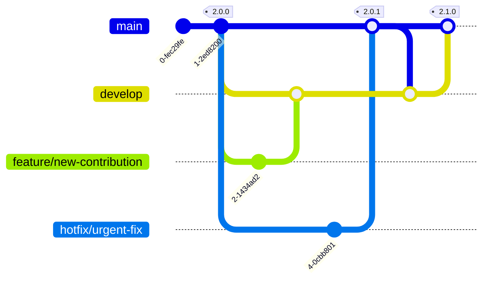
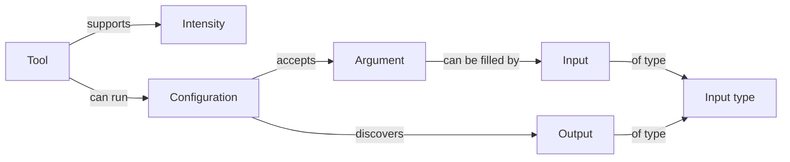

# Contributing to Rekono

## Branches

- **Features and bug fixes** go to `develop`, from a `feature/...` or `bugfix/...` branch.
- **Hotfixes** for a released version go to `main`, from a `hotfix/...` branch, and are merged back into `develop`.


```mermaid
gitGraph
    commit
    commit tag: "2.0.0"
    branch develop
    checkout develop
    branch feature/new-contribution
    checkout feature/new-contribution
    commit
    checkout develop
    merge feature/new-contribution
    checkout main
    branch hotfix/urgent-fix
    checkout hotfix/urgent-fix
    commit
    checkout main
    merge hotfix/urgent-fix tag: "2.0.1"
    checkout develop
    merge main
    checkout main
    merge develop tag: "2.1.0"
```

## Development environment

Rekono has three independent projects, each one with its own dependencies: `backend/` (Django REST API and workers), `frontend/` (Nuxt UI) and `email-templates/` (React Email templates used by the backend).

### Requirements

- Python 3.13+ with [uv](https://docs.astral.sh/uv/)
- Node.js 22+ with [pnpm](https://pnpm.io/)
- PostgreSQL
- Valkey

There are some libraries that require the installation of some packages. On Debian systems the installation of the following packages is required:

```bash
sudo apt install libpq-dev libmagic1 libgcc-s1 libxml2-dev libxslt-dev python3-dev libjpeg-dev zlib1g-dev
```

### PostgreSQL & Valkey

Start both services and create the empty rekono database:

```bash
sudo systemctl enable --now postgresql valkey-server
sudo -u postgres psql
```

```sql
CREATE USER rekono WITH ENCRYPTED PASSWORD 'rekono';
CREATE DATABASE rekono;
ALTER DATABASE rekono OWNER TO rekono;
```

### Configuration

When `/opt/rekono` doesn't exist, the repository root is used as Rekono home, so the `config.yaml` at the root is the one used. Set the database credentials there, or in the `RKN_DB_USER` and `RKN_DB_PASSWORD` environment variables. Never commit real credentials.

### Backend

```bash
# backend/
# Install dependencies
uv sync --locked

# Initialize database
uv run manage.py migrate

# Update resources status
uv run manage.py remove_deprecated_steps
uv run manage.py update_wordlists_size
uv run manage.py update_tools_status

# Create your initial Admin user
uv run manage.py createsuperuser

# Enqueue the first monitor job, since each one only schedules the next one
uv run manage.py monitor

# Run the backend in development mode
uv run manage.py runserver

# Run each worker in its own terminal
uv run manage.py rqworker tasks --with-scheduler
uv run manage.py rqworker-pool executions --num-workers 10
uv run manage.py rqworker findings
uv run manage.py rqworker monitor --with-scheduler
```

> `logs/rekono.log` has the logs of every component except the frontend.

### Email templates

The backend uses the compiled HTML, not the React sources, so build them at least once:

```bash
# email-templates/
pnpm install
pnpm run build     # exports the HTML templates to backend/platforms/email/templates/
```

### Frontend

```bash
# frontend/
echo "NODE_ENV=development" > .env
pnpm install
pnpm run dev       # proxies /api to http://127.0.0.1:8000, so the backend has to be running
```

## Agentic Development

The [pablosnt/skills](https://github.com/pablosnt/skills) repository has skills specialized in Rekono development (integrations, frontend pages, unit tests and docstrings) that make coding with agents much more accurate. `skills-lock.json` pins every skill this project uses, and they are installed into your environment with:

```bash
npx skills@latest experimental_install
```

## Code style

Install the pre-commit hooks once, so the formatters and linters run before every commit:

```bash
python3 -m pip install pre-commit && pre-commit install
```

The formatters and linters can be executed manually with:

```bash
# backend/
uvx ruff format
uvx ruff==0.15.22 check --fix
uvx ruff check --select I --fix

# frontend/
pnpm run prettier:fix
pnpm run eslint:fix

# email-templates/
pnpm run prettier:fix
pnpm run eslint:fix
```

**All backend code, except tests and migrations, needs docstrings following the [Google style guide](https://google.github.io/styleguide/pyguide.html#38-comments-and-docstrings)**. You can use the [rekono-docstrings](#agentic-development) skill to generate them faster. Frontend code is the opposite case, don't add comments to it, since comments would be exposed to the users.

## Unit tests

```bash
# backend/
uv run coverage run --concurrency=multiprocessing,thread manage.py test --parallel 50
uv run coverage combine && uv run coverage report -m --skip-covered
```

The tests use an in-memory SQLite database, so only Valkey is needed to run them. **New code needs unit tests, and the total coverage has to stay above 95%**, which is checked in CI.

## Common Contributions

### New hacking tool

A tool is defined by data, in `backend/tools/`:


```mermaid
flowchart LR
    Tool -->|supports| Intensity
    Tool -->|can run| Configuration
    Configuration -->|accepts| Argument
    Configuration -->|discovers| Output
    Argument -->|can be filled by| Input
    Input -->|of type| InputType["Input type"]
    Output -->|of type| InputType
```

A **tool** can do several things, and each one is a **configuration** with its own command template. Every placeholder of that template is an **argument**, and each argument declares the **inputs** that can fill it, in priority order, pointing to the **input type** that provides the data. The **intensities** map the Rekono intensity levels to the arguments of the tool. Finally, the **outputs** declare what the configuration discovers, which is what lets a process chain its configurations. 

| File | Loaded by |
| --- | --- |
| `data/1_tools.json` | A migration, since the configurations reference the tools |
| `data/3_configurations.json` | A migration, since the steps and the executions reference the configurations |
| `fixtures/2_intensities.json` | Django fixtures, recreated on every `migrate` |
| `fixtures/4_arguments.json` | Django fixtures, recreated on every `migrate` |
| `fixtures/5_inputs.json` | Django fixtures, recreated on every `migrate` |
| `fixtures/6_outputs.json` | Django fixtures, recreated on every `migrate` |

Steps to add a new tool:

1. Add the tool to `data/1_tools.json` and its configurations to `data/3_configurations.json`, with the next free `pk` and a `migration` key naming the migration that will create them.
2. Add its intensities, arguments, inputs and outputs to the fixture files. The arguments are written with the input keywords of `backend/framework/enums.py`, like `-p {ports_commas}`.
3. Create that migration in `backend/tools/migrations/`, copying the pattern of `0004_remove_argument_unique_argument_and_more.py`. It only writes the entries whose `migration` key names it, with `update_or_create`.
4. Add the tool to the default processes, in a new migration of the `processes` app.
5. Create the parser in `backend/tools/parsers/`, extending `BaseParser` and implementing `_parse`. The class name is the tool name without spaces, which is how it's resolved.
6. Create an executor in `backend/tools/executors/` **only if the tool misbehaves or has special requirements**, like Nikto writing its report somewhere else. Most tools don't need one.
7. Add unit tests:
  - The tool report for testing in `backend/tests/data/reports/<tool_name>/`. Anonymize the report before committing it.
  - Test case in `backend/tests/parsers/`.
8. Add the tool installation to `docker/Dockerfile`.
9. Add the tool icon domain to the `img-src` of the CSP in `docker/nginx/nginx.conf`.
10. Add the tool to the [README](README.md).

### Update a tool

Intensities, arguments, inputs and outputs are loaded again after every `migrate`, so editing the fixture file is enough.

Tools and configurations are not, so their entry has to be edited and a new migration that ensures the data is updated must be created. In that way, we ensure that users that already have the tool's previous metadata in their database, get the new tool's metadata when they update their Rekono version.

### Remove a tool

**Identifiers have to stay consistent, so entries are never deleted.** Deleting a configuration would also delete the scans and executions that used it. Mark its configurations as `deprecated` instead following the [update a tool](#update-a-tool) section, and remove their arguments, inputs, outputs and intensities from the fixtures. A tool without active configurations disappears from the API, while everything that referenced it keeps working.

### New integration

Integrations with external platforms live in `backend/platforms/`, and extend one of these classes from `backend/framework/platforms.py`:

- `BaseIntegration` to enrich findings or sync them somewhere else, like VirusTotal or DefectDojo.
- `BaseCveProvider` to enrich vulnerabilities with CVE data, like NVD NIST or OSV.
- `BaseNotification` to notify the users, like SMTP or Telegram.

An integration that needs nothing from the user is a single file, like `platforms/osv.py`. One that needs credentials or settings is a Django app, like `platforms/virustotal/`, with its integration, model, serializer, view, urls and migration. In any case, the new integration must be registered as so:

1. Add its entry to the `Integration` table, in a new migration of the `integrations` app. The `key` has to be the name of your class in lowercase, since that's how the integration finds itself.
2. Add the integration to the right list in `backend/findings/queues.py`.
3. Add the tests in `backend/tests/platforms/`, and update `backend/tests/test_integrations.py`.
4. Add its settings form to `frontend/app/components/admin/integrations.vue`.
5. Add its icon domain to the `img-src` of the CSP in `docker/nginx/nginx.conf`.

## Way of code

- Keep the code style, and reuse what is already there instead of duplicating it
- Keep it simple. Don't overcomplicate the code
- Document the backend, don't comment the frontend
- Add an entry to the [CHANGELOG](CHANGELOG.md) with your change
- Test your code, and keep the coverage above 95%
- Rekono is a cybersecurity project, don't introduce vulnerabilities or vulnerable dependencies
- Don't report a vulnerability in a public pull request or issue, follow the [security policy](SECURITY.md) instead
- All pull requests need to pass the CI checks and be approved before being merged


Thank you for making Rekono better! :heart: